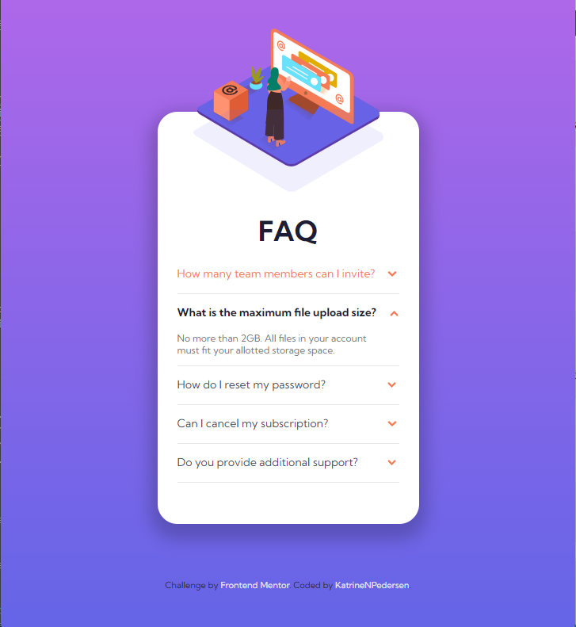

# Frontend Mentor - FAQ accordion card solution

This is a solution to the [FAQ accordion card challenge on Frontend Mentor](https://www.frontendmentor.io/challenges/faq-accordion-card-XlyjD0Oam). Frontend Mentor challenges help you improve your coding skills by building realistic projects.

## Table of contents

- [Overview](#overview)
  - [The challenge](#the-challenge)
  - [Screenshot](#screenshot)
  - [Links](#links)
- [My process](#my-process)
  - [Built with](#built-with)
  - [What I learned](#what-i-learned)
  - [Continued development](#continued-development)
- [Author](#author)

## Overview

### The challenge

Users should be able to:

- View the optimal layout for the component depending on their device's screen size
- See hover states for all interactive elements on the page
- Hide/Show the answer to a question when the question is clicked

### Screenshot

### Links

- Solution URL: [https://github.com/KatrineNPedersen/FAQ-Accordion-Card.git]
- Live Site URL: [https://katrinenpedersen.github.io/FAQ-Accordion-Card]

## My process

### Built with

- Semantic HTML5 markup
- Flexbox
- Mobile-first workflow
- JavaScript

### What I learned

This challenge was great practice for selecting child classes of specific parents.

### Continued development

While I am able to create the required design for the specific mobile and laptop sizes as requested, I will continue to work on the site being responsive past those specified widths.

## Author

- Frontend Mentor - [@KatrineNPedersen](https://www.frontendmentor.io/profile/KatrineNPedersen)
